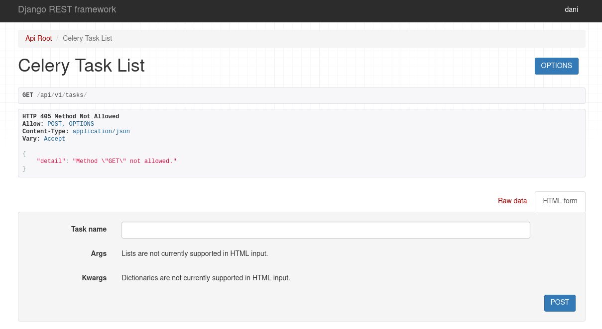
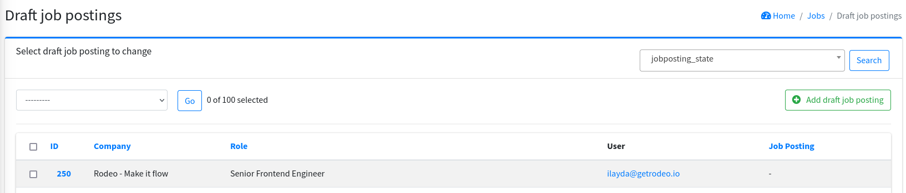

# django tools

A collection of Django tools to simplify development.

### Celery HTTP API

Exposes an embedded DRF API to trigger Celery tasks. Allows you to trigger tasks via curl or the
browser docs. Useful for development.



```python
from rest_framework.routers import DefaultRouter
from django_toolshed.celery_views import CeleryTaskViewSet

if settings.DEBUG:
    router = DefaultRouter()
    router.register("tasks", CeleryTaskViewSet, basename="tasks")

urlpatterns = router.urls
```

### User URL mixin

Creates a linkable column in the admin if the model has a user property. Displays the users' email
in the users column.



```python
from django.contrib import admin
from django_toolshed.mixins import UserURLMixin


@admin.register(DraftJobPosting)
class DraftJobPostingAdmin(UserURLMixin, admin.ModelAdmin):
    form = DraftJobPostingAdminForm
    list_display = (
        "id",
        "company",
        "role",
        "user_url",
        "job_posting_link",
    )
    list_filter = (JobPostingStateFilter,)
```
